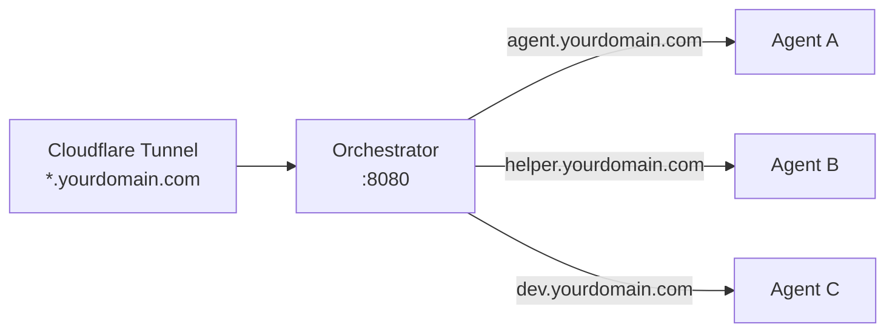
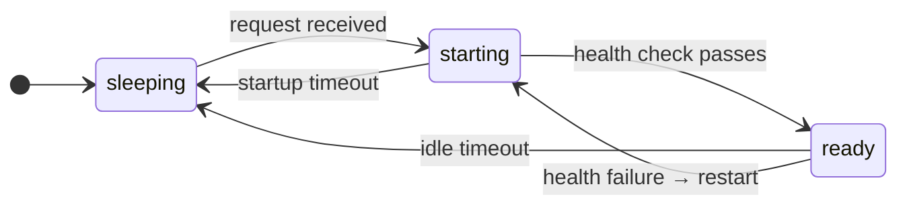
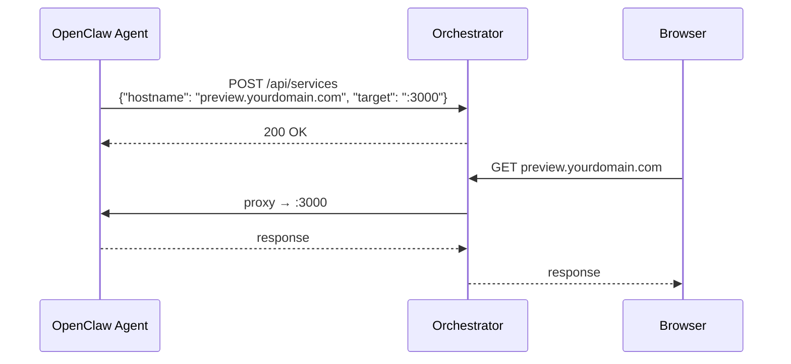
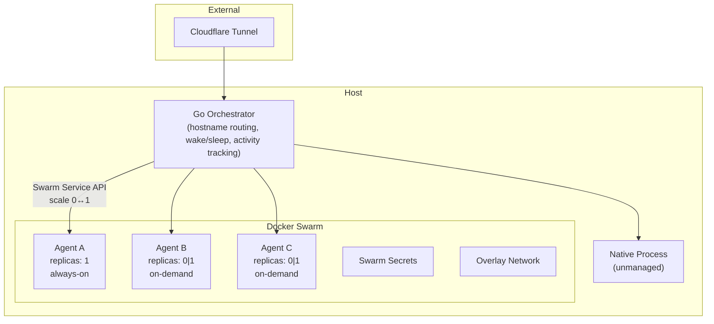

# Warren

A reverse proxy that manages [OpenClaw](https://openclaw.ai) agents running in Docker. Point your Cloudflare Tunnel at it, configure your agents in YAML, and it handles routing, lifecycle, health monitoring, and on-demand wake/sleep — so agents that aren't in use consume zero resources.

## Why

Running multiple OpenClaw agents on one server is a pain. You're manually managing containers, docker-compose files, port allocations, health monitoring, and tunnel config. Each new agent means touching multiple files. Agents that aren't used 24/7 still burn CPU and RAM because there's no way to automatically sleep and wake them.

Warren fixes this with a single Go binary and two YAML files.

## What It Does

### Hostname Routing

Every request to `*.yourdomain.com` hits the orchestrator, which reads the `Host` header and forwards to the right container. Adding a new agent is one YAML block — no tunnel changes, no port juggling.



### Lifecycle Policies

Three policies control how agents are managed:

| Policy | Behaviour | Use Case |
|---|---|---|
| **unmanaged** | Pure passthrough, no lifecycle management | Agents you run yourself (native process, systemd, etc.) |
| **always-on** | Swarm keeps it running, orchestrator monitors health | Critical agents that must always be available |
| **on-demand** | Sleeps at zero replicas, wakes on first request, sleeps after idle timeout | Agents used intermittently — saves resources when idle |



### Agent-Created Services

OpenClaw agents can spin up services inside their container — web servers, preview apps, dev tools. These register with the orchestrator and get their own hostnames:



When the container sleeps, service routes are cleaned up automatically.

### WebSocket Support

OpenClaw communicates over WebSocket. The proxy handles `Connection: Upgrade` correctly, tracks active WebSocket connections per agent, and never considers an agent idle while it has open connections.

## Architecture



**Responsibility split:**

- **Orchestrator** handles intelligence — hostname routing, wake-on-request, idle detection, WebSocket-aware activity tracking, connection holding during cold starts.
- **Swarm** handles infrastructure — container images, health checks, restart policies, secrets, resource limits, overlay networking, rolling updates.

## Quick Start

### Prerequisites

- Go 1.22+
- Docker with Swarm mode (`docker swarm init`)
- Cloudflare Tunnel (or any reverse proxy pointing at the orchestrator)

### 1. Build

```bash
make build
```

### 2. Configure

Create `orchestrator.yaml`:

```yaml
listen: ":8080"

defaults:
  health_check_interval: 30s

agents:
  my-agent:
    hostname: "agent.yourdomain.com"
    # Use Swarm DNS for overlay network routing (no published ports needed).
    backend: "http://tasks.openclaw_my-agent:18790"
    policy: always-on
    container:
      name: "openclaw_my-agent"
    health:
      url: "http://tasks.openclaw_my-agent:18790/health"
      check_interval: 30s
      max_failures: 3
      max_restart_attempts: 10

  my-on-demand-agent:
    hostname: "dev.yourdomain.com"
    backend: "http://tasks.openclaw_my-dev-agent:8081"
    policy: on-demand
    container:
      name: "openclaw_my-dev-agent"
    health:
      url: "http://tasks.openclaw_my-dev-agent:8081/api/health"
      startup_timeout: 60s
      max_failures: 3
      max_restart_attempts: 5
    idle:
      timeout: 30m
```

### 3. Deploy Agents to Swarm

```bash
# Create secrets
echo "sk-your-api-key" | docker secret create agent-api-key -

# Deploy stack
docker stack deploy -c stack.yaml openclaw
```

See [Containerising Agents](docs/containerising-agents.md) for how to package OpenClaw agents as Docker images.

### 4. Run

```bash
./bin/orchestrator --config orchestrator.yaml
```

### 5. Point Your Tunnel

```yaml
# cloudflared config
ingress:
  - hostname: "*.yourdomain.com"
    service: http://localhost:8080
  - service: http_status:404
```

One rule. Never needs changing again.

## Configuration Reference

### Top Level

| Field | Type | Default | Description |
|---|---|---|---|
| `listen` | string | `:8080` | Address to listen on |
| `defaults.health_check_interval` | duration | `30s` | Default health check interval for all agents |

### Agent

| Field | Type | Required | Description |
|---|---|---|---|
| `hostname` | string | yes | Hostname to route to this agent |
| `backend` | string | yes | URL of the agent's HTTP endpoint. In Swarm mode, use Swarm DNS: `http://tasks.<stack>_<service>:<port>` |
| `policy` | string | yes | `unmanaged`, `always-on`, or `on-demand` |
| `container.name` | string | for managed policies | Docker container or Swarm service name |
| `idle.drain_timeout` | duration | `30s` | Max time to wait for WebSocket drain on shutdown |
| `health.url` | string | for managed policies | Health check URL |
| `health.check_interval` | duration | from defaults | How often to poll health |
| `health.startup_timeout` | duration | `60s` | Max time to wait for healthy on startup |
| `health.max_failures` | int | `3` | Consecutive failures before restart |
| `health.max_restart_attempts` | int | `10` | Max restarts before marking degraded |
| `idle.timeout` | duration | `30m` | Idle time before sleeping (on-demand only) |

## Project Structure

```
warren/
├── cmd/orchestrator/          # entry point
├── internal/
│   ├── config/                # YAML config + validation
│   ├── proxy/                 # reverse proxy, WebSocket, activity tracking
│   ├── policy/                # lifecycle policies (always-on, on-demand, unmanaged)
│   └── container/             # Docker container + Swarm service management
├── examples/
│   ├── simple-agent/          # minimal single-agent Dockerfile
│   └── multi-agent/           # supervisord pattern for multi-process containers
├── deploy/
│   ├── stack.yaml             # example Swarm stack
│   └── orchestrator.example.yaml
├── docs/
│   ├── architecture.md        # detailed architecture + design decisions
│   ├── containerising-agents.md  # how to package OpenClaw agents
│   └── spec-delta.md          # spec vs implementation gap analysis
└── Makefile
```

## Docs

- [Architecture](docs/architecture.md) — detailed design, responsibility split, scaling path
- [Containerising Agents](docs/containerising-agents.md) — how to package OpenClaw agents as Docker images
- [Spec Delta & TODO](docs/spec-delta.md) — gap analysis and roadmap

## License

MIT