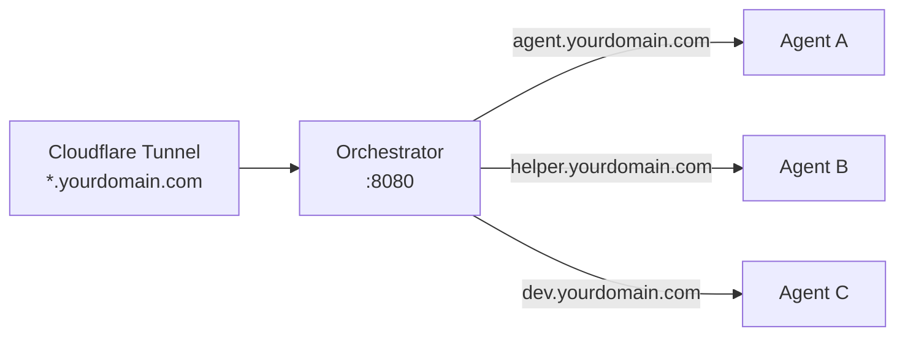
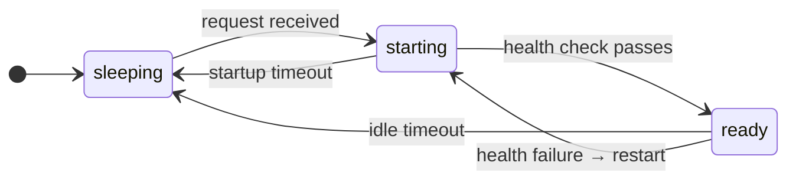
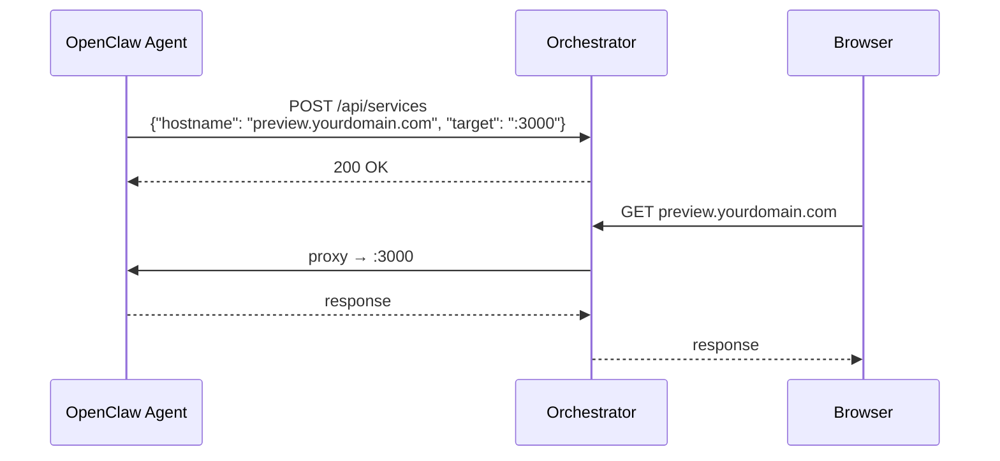
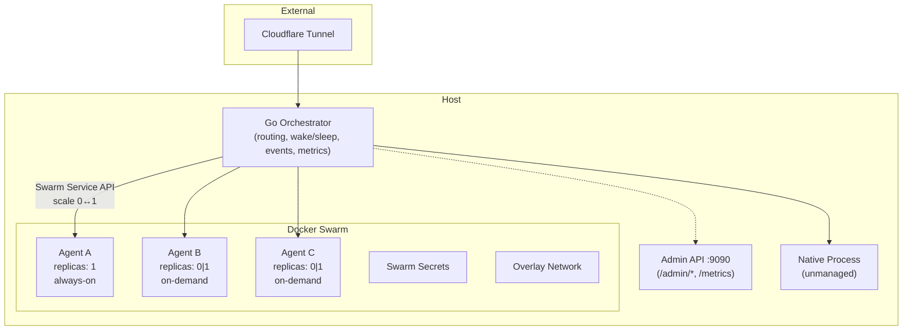

# Warren

A reverse proxy that manages [OpenClaw](https://openclaw.ai) agents running in Docker. Point your Cloudflare Tunnel at it, configure your agents in YAML, and it handles routing, lifecycle, health monitoring, and on-demand wake/sleep — so agents that aren't in use consume zero resources.

## Why

Running multiple OpenClaw agents on one server is a pain. You're manually managing containers, docker-compose files, port allocations, health monitoring, and tunnel config. Each new agent means touching multiple files. Agents that aren't used 24/7 still burn CPU and RAM because there's no way to automatically sleep and wake them.

Warren fixes this with a single Go binary and two YAML files.

## Features

- **Hostname routing** — route `*.yourdomain.com` to the right container by `Host` header
- **Lifecycle policies** — `unmanaged`, `always-on`, `on-demand` (sleep at 0 replicas, wake on first request)
- **Service registration API** — agents register dynamic hostnames at runtime (`POST /api/services`)
- **Admin API** — separate port with agent listing, manual wake/sleep, health, and metrics
- **WebSocket support** — frame-level activity tracking, connection-aware idle detection
- **Event system** — structured events for all state transitions (`agent.ready`, `agent.sleep`, etc.)
- **Prometheus metrics** — `/metrics` endpoint on the admin port
- **Webhook alerting** — Slack-compatible webhook notifications on agent events
- **LRU eviction** — automatically sleep least-recently-used on-demand agents when `max_ready_agents` is exceeded
- **Config hot-reload** — send `SIGHUP` to reload YAML without restart
- **Graceful shutdown** — WebSocket drain with configurable timeout on `SIGTERM`
- **Swarm event watching** — real-time Docker event subscription for container state changes
- **Systemd deployment** — run the orchestrator as a system service

## What It Does

### Hostname Routing

Every request to `*.yourdomain.com` hits the orchestrator, which reads the `Host` header and forwards to the right container. Adding a new agent is one YAML block — no tunnel changes, no port juggling.



### Lifecycle Policies

Three policies control how agents are managed:

| Policy | Behaviour | Use Case |
|---|---|---|
| **unmanaged** | Pure passthrough, no lifecycle management | Agents you run yourself (native process, systemd, etc.) |
| **always-on** | Swarm keeps it running, orchestrator monitors health | Critical agents that must always be available |
| **on-demand** | Sleeps at zero replicas, wakes on first request, sleeps after idle timeout | Agents used intermittently — saves resources when idle |



### Agent-Created Services

OpenClaw agents can spin up services inside their container — web servers, preview apps, dev tools. These register with the orchestrator via the service registration API and get their own hostnames:



When the container sleeps, service routes are cleaned up automatically.

### Admin API & Observability

The admin API runs on a separate port and provides:

```mermaid
flowchart LR
    subgraph Admin[":9090 Admin Port"]
        A1["GET /admin/agents"]
        A2["GET /admin/agents/:name"]
        A3["POST /admin/agents/:name/wake"]
        A4["POST /admin/agents/:name/sleep"]
        A5["GET /admin/services"]
        A6["GET /admin/health"]
        A7["GET /metrics"]
    end
    
    PROM["Prometheus"] -->|scrape| A7
    SLACK["Slack"] <--|webhook| ORC["Event System"]
```

- **Agent listing** with real-time state
- **Manual wake/sleep** for on-demand agents
- **Service registry** inspection
- **Health** with uptime and WebSocket connection count
- **Prometheus metrics** — counters, gauges, histograms for all agent operations
- **Webhook alerting** — push events to Slack-compatible endpoints

### WebSocket Support

OpenClaw communicates over WebSocket. The proxy handles `Connection: Upgrade` correctly, tracks active WebSocket connections per agent with frame-level activity updates, and never considers an agent idle while it has open connections.

### Event System

All state transitions emit structured events consumed by metrics, webhooks, and the LRU eviction system:

| Event | Description |
|---|---|
| `agent.ready` | Agent passed health checks and is serving traffic |
| `agent.starting` | Agent is booting (scaled 0→1) |
| `agent.sleep` | Agent went to sleep (scaled 1→0) |
| `agent.wake` | Wake signal received |
| `agent.degraded` | Health checks failing |
| `agent.health_failed` | Individual health check failure |
| `restart.exhausted` | Max restart attempts reached |
| `docker.*` | Raw Docker Swarm events |

## Architecture



**Responsibility split:**

- **Orchestrator** handles intelligence — hostname routing, wake-on-request, idle detection, WebSocket-aware activity tracking, connection holding during cold starts, event emission, metrics, alerting.
- **Swarm** handles infrastructure — container images, health checks, restart policies, secrets, resource limits, overlay networking, rolling updates.

## Quick Start

### Prerequisites

- Go 1.22+
- Docker with Swarm mode (`docker swarm init`)
- Cloudflare Tunnel (or any reverse proxy pointing at the orchestrator)

### 1. Build

```bash
make build
```

### 2. Configure

Create `orchestrator.yaml` (see [configs/orchestrator.example.yaml](configs/orchestrator.example.yaml) for all options):

```yaml
listen: ":8080"
admin_listen: ":9090"
max_ready_agents: 5

defaults:
  health_check_interval: 30s

webhooks:
  - url: "https://your-slack-webhook-url"
    events: ["agent.degraded", "restart.exhausted"]

agents:
  my-agent:
    hostname: "agent.yourdomain.com"
    backend: "http://tasks.openclaw_my-agent:18790"
    policy: always-on
    container:
      name: "openclaw_my-agent"
    health:
      url: "http://tasks.openclaw_my-agent:18790/health"
      check_interval: 30s
      max_failures: 3
      max_restart_attempts: 10

  my-on-demand-agent:
    hostname: "dev.yourdomain.com"
    hostnames:
      - "preview.yourdomain.com"
    backend: "http://tasks.openclaw_my-dev-agent:8081"
    policy: on-demand
    container:
      name: "openclaw_my-dev-agent"
    health:
      url: "http://tasks.openclaw_my-dev-agent:8081/api/health"
      startup_timeout: 60s
      max_failures: 3
      max_restart_attempts: 5
    idle:
      timeout: 30m
      drain_timeout: 30s
```

### 3. Deploy Agents to Swarm

```bash
# Create secrets
echo "sk-your-api-key" | docker secret create agent-api-key -

# Deploy stack
docker stack deploy -c stack.yaml openclaw
```

See [Containerising Agents](docs/containerising-agents.md) for how to package OpenClaw agents as Docker images.

### 4. Run

```bash
./bin/orchestrator --config orchestrator.yaml
```

Or with systemd:

```bash
sudo cp deploy/warren-orchestrator.service /etc/systemd/system/
sudo systemctl enable --now warren-orchestrator
```

### 5. Point Your Tunnel

```yaml
# cloudflared config
ingress:
  - hostname: "*.yourdomain.com"
    service: http://localhost:8080
  - service: http_status:404
```

One rule. Never needs changing again.

### 6. Config Hot-Reload

```bash
# Reload config without downtime
sudo systemctl reload warren-orchestrator
# or
warren reload
```

Runtime-safe changes (idle timeouts, health intervals, failure thresholds) apply immediately. Structural changes (new agents, hostname changes) require a restart.

> **Tip:** You can also use the `warren` CLI instead of editing config files manually. See the [CLI](#cli) section below.

## CLI

Warren ships two binaries: `warren-server` (the orchestrator) and `warren` (the CLI). The CLI talks to the admin API over HTTP, so you can manage agents, services, and deployments without editing YAML or curling endpoints.

### Installation

```bash
make build
# Produces bin/warren-server and bin/warren
```

### Configuration

The CLI resolves the admin API URL in order:

1. `--admin` flag — `warren --admin http://host:9090 status`
2. `WARREN_ADMIN` env var
3. `~/.warren/config.yaml` (`admin: "http://host:9090"`)
4. Default: `http://localhost:9090`

### Global Flags

| Flag | Default | Description |
|---|---|---|
| `--admin` | `http://localhost:9090` | Admin API URL |
| `--format` | `table` | Output format: `table` or `json` |

### Agent Management

```bash
# List all agents
warren agent list
```
```
NAME          HOSTNAME                   POLICY     STATE    CONNECTIONS
friend        friend.yourdomain.com      always-on  ready    2
dutybound     kai.yourdomain.com         on-demand  sleeping 0
root          root.yourdomain.com        unmanaged  ready    1
```

```bash
# Add an agent dynamically (zero downtime, no disconnections)
warren agent add --name my-agent --hostname agent.example.com \
  --policy on-demand --idle-timeout 30m

# Or interactively
warren agent add

# Inspect, wake, sleep, remove
warren agent inspect dutybound
warren agent wake dutybound
warren agent sleep dutybound
warren agent remove dutybound

# Tail logs
warren agent logs dutybound
```

Dynamic agent creation via `agent add` happens at runtime — no restart needed, no existing connections disrupted.

### Service Management

```bash
warren service list
warren service add --hostname preview.example.com --target http://tasks.openclaw_dev:3000 --agent dev
warren service remove preview.example.com
```

### Operations

```bash
# Orchestrator status
warren status
```
```
Warren Orchestrator
  Uptime:      3d 14h 22m
  Agents:      5 (3 ready, 2 sleeping)
  Connections: 4 active WebSocket
  Services:    2 dynamic routes
```

```bash
# Hot-reload config
warren reload

# Stream real-time events (SSE)
warren events

# Validate config file
warren config validate orchestrator.yaml
```

### Scaffolding & Deployment

```bash
# Generate template configs
warren init

# Scaffold a new agent directory
warren scaffold my-agent

# Deploy stack
warren deploy --file stack.yaml --name openclaw

# Create Docker secrets
warren secrets set agent-api-key
```

For the full CLI reference with all flags and examples, see [docs/cli.md](docs/cli.md).

## Configuration Reference

### Top Level

| Field | Type | Default | Description |
|---|---|---|---|
| `listen` | string | `:8080` | Address for the main proxy |
| `admin_listen` | string | *(disabled)* | Address for the admin API and metrics (e.g. `:9090`) |
| `max_ready_agents` | int | `0` (unlimited) | Max on-demand agents awake at once; triggers LRU eviction |
| `defaults.health_check_interval` | duration | `30s` | Default health check interval for all agents |
| `webhooks` | list | `[]` | Webhook endpoints for event alerting |
| `webhooks[].url` | string | — | Webhook URL (Slack-compatible JSON payload) |
| `webhooks[].headers` | map | — | Extra HTTP headers to include |
| `webhooks[].events` | list | all | Event types to send (e.g. `["agent.degraded"]`) |

### Agent

| Field | Type | Required | Description |
|---|---|---|---|
| `hostname` | string | yes | Primary hostname to route to this agent |
| `hostnames` | list | no | Additional hostnames for this agent |
| `backend` | string | yes | URL of the agent's HTTP endpoint. In Swarm, use `http://tasks.<stack>_<service>:<port>` |
| `policy` | string | yes | `unmanaged`, `always-on`, or `on-demand` |
| `container.name` | string | for managed | Docker Swarm service name |
| `container.labels` | map | no | Labels for container discovery |
| `health.url` | string | for managed | Health check URL |
| `health.check_interval` | duration | from defaults | How often to poll health |
| `health.startup_timeout` | duration | `60s` | Max time to wait for healthy on startup |
| `health.max_failures` | int | `3` | Consecutive failures before restart |
| `health.max_restart_attempts` | int | `10` | Max restarts before marking degraded |
| `idle.timeout` | duration | `30m` | Idle time before sleeping (on-demand only) |
| `idle.drain_timeout` | duration | `30s` | Max time to wait for WebSocket drain on sleep/shutdown |

## Service Registration API

Agents can register dynamic hostnames at runtime:

```bash
# Register a service
curl -X POST http://orchestrator:8080/api/services \
  -H 'Content-Type: application/json' \
  -d '{"hostname": "preview.yourdomain.com", "target": ":3000"}'

# List registered services
curl http://orchestrator:8080/api/services

# Deregister
curl -X DELETE http://orchestrator:8080/api/services/preview.yourdomain.com
```

Dynamic routes are tied to the parent agent and automatically purged when the agent sleeps.

## Project Structure

```
warren/
├── cmd/orchestrator/          # entry point
├── internal/
│   ├── admin/                 # admin API (agent listing, wake/sleep, health)
│   ├── alerts/                # webhook alerting (Slack-compatible)
│   ├── config/                # YAML config, validation, hot-reload
│   ├── container/             # Docker Swarm service management, discovery, watcher
│   ├── events/                # event emission system
│   ├── metrics/               # Prometheus metrics
│   ├── policy/                # lifecycle policies (always-on, on-demand, unmanaged, LRU)
│   ├── proxy/                 # reverse proxy, WebSocket, activity tracking
│   └── services/              # dynamic service registry
├── configs/
│   └── orchestrator.example.yaml
├── deploy/
│   └── stack.yaml             # example Swarm stack
├── docker/
│   └── dutybound/             # example agent container
├── docs/
│   ├── architecture.md        # detailed architecture + design decisions
│   └── containerising-agents.md  # how to package OpenClaw agents
└── Makefile
```

## Testing

```bash
# Run all tests with race detection
make test

# Lint
make lint

# Full CI pipeline (build + test + lint)
make ci
```

The test suite covers all packages with unit tests and integration tests for the proxy layer.

## Docs

- [Architecture](docs/architecture.md) — detailed design, event system, metrics pipeline, LRU eviction
- [CLI Reference](docs/cli.md) — complete command reference with examples
- [Containerising Agents](docs/containerising-agents.md) — how to package OpenClaw agents as Docker images

## License

MIT
