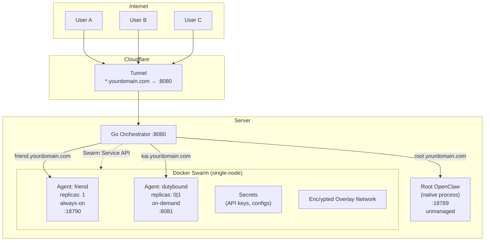
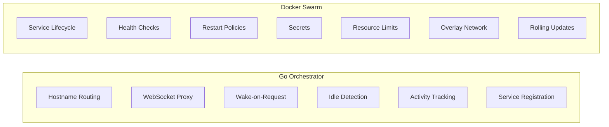
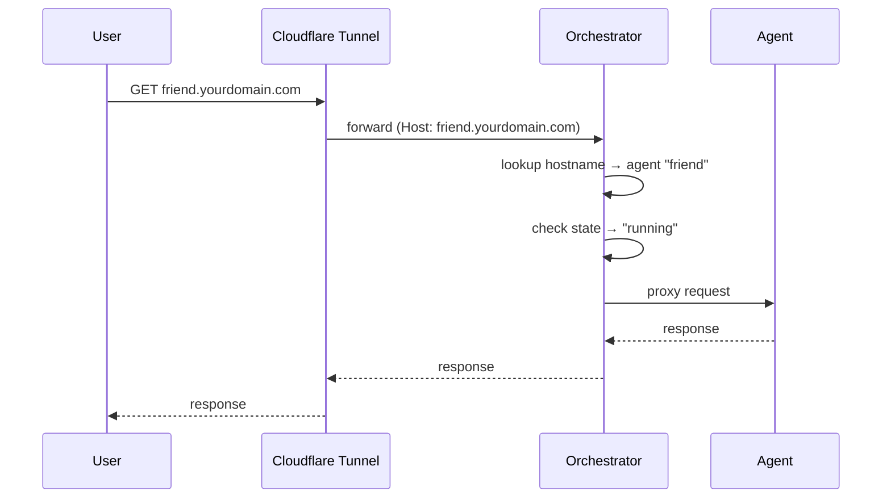
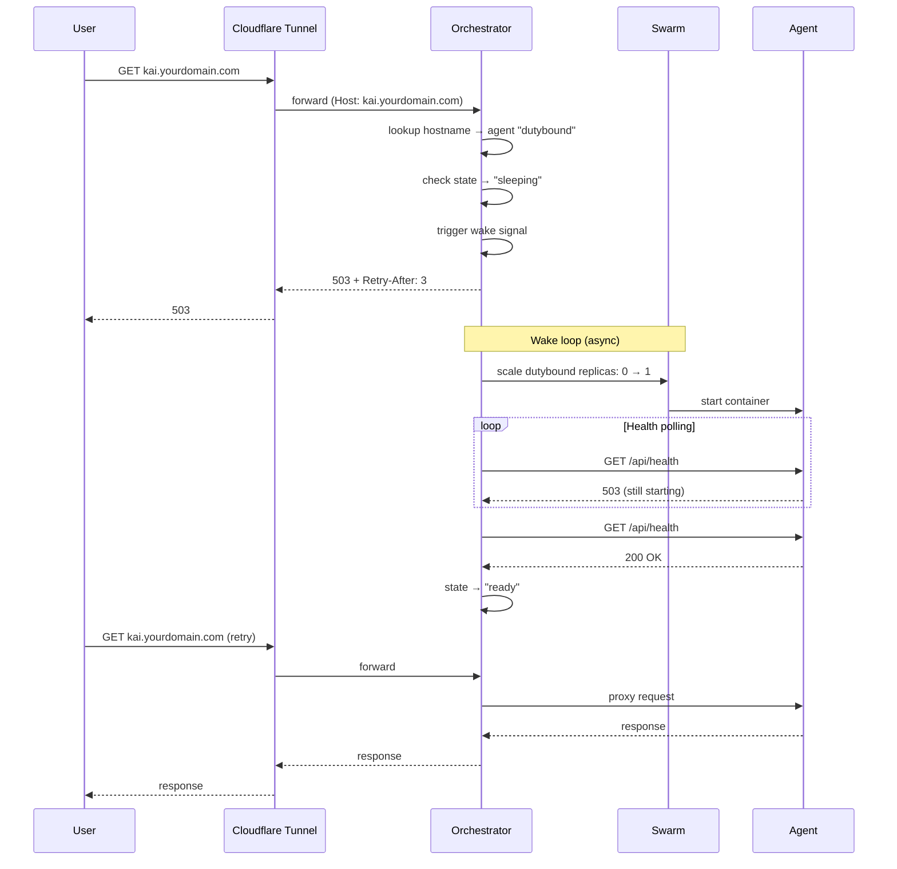
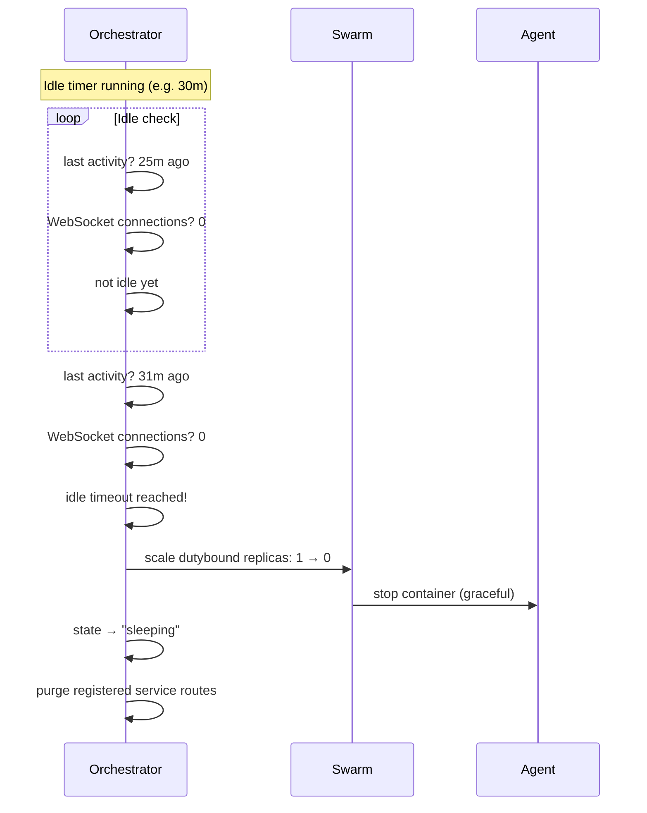
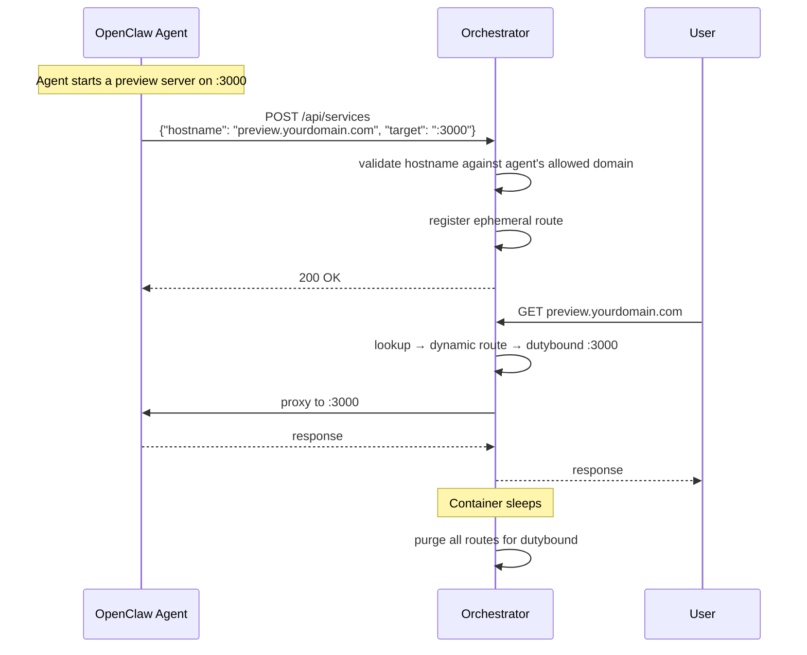
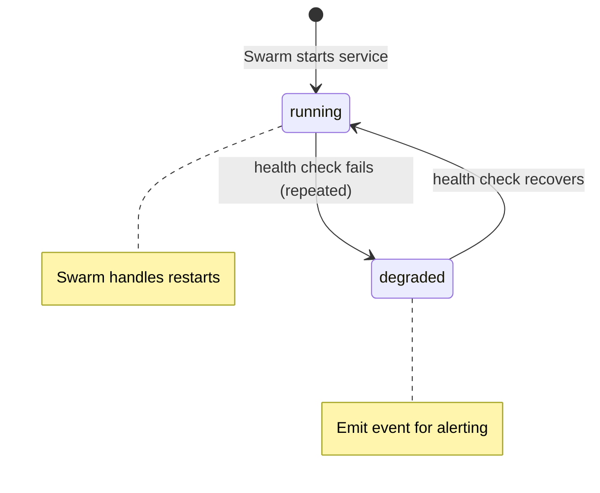
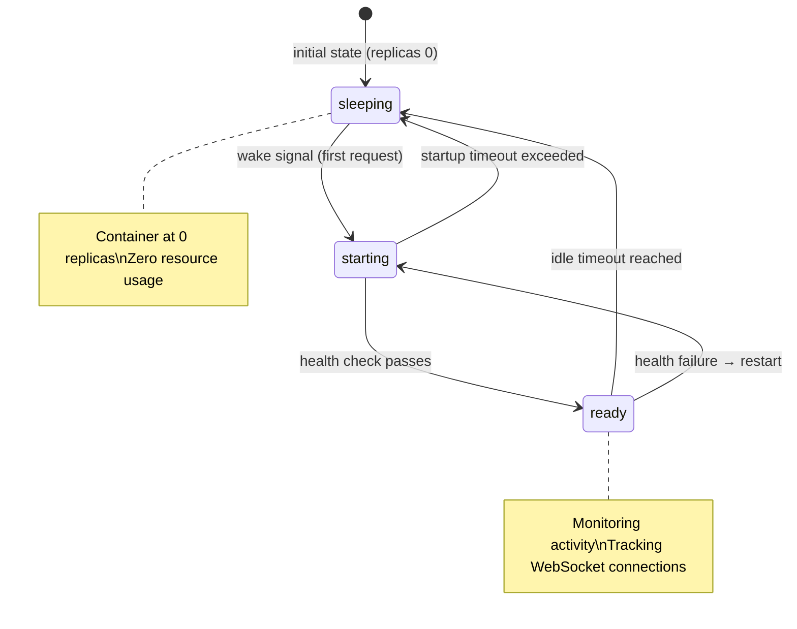
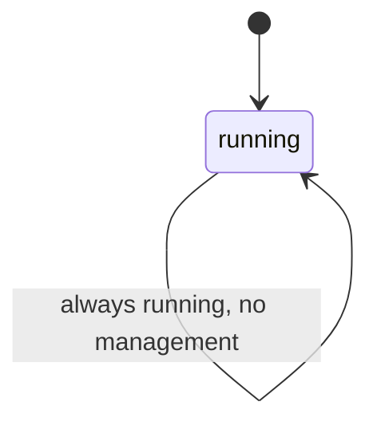

# Architecture

## Overview

OpenClaw Orchestrator sits between a Cloudflare Tunnel (or any reverse proxy) and a Docker Swarm cluster. It routes HTTP and WebSocket traffic by hostname, manages agent lifecycle through configurable policies, and tracks activity to automatically sleep idle agents.

## Responsibility Split

The orchestrator and Swarm have a clean division of labour. The orchestrator never reimplements what Swarm provides natively.

| Concern | Owner | How |
|---|---|---|
| Hostname → backend routing | Orchestrator | Host header map lookup |
| WebSocket proxying | Orchestrator | HTTP Upgrade + bidirectional pipe |
| Wake-on-request | Orchestrator | Scale service 0→1 on first request |
| Idle timeout / sleep | Orchestrator | Track activity, scale 1→0 after timeout |
| Agent-created service routing | Orchestrator | Dynamic route registration API |
| Health checks + auto-restart | Swarm | Service `healthcheck` + restart policy |
| Secrets | Swarm | `docker secret` → `/run/secrets/` |
| Resource limits | Swarm | Service `resources.limits` |
| Networking | Swarm | Encrypted overlay network |
| Declarative deployment | Swarm | `docker stack deploy` |

## Request Flow

### Always-On Agent

### On-Demand Agent (Cold Start)

### On-Demand Agent (Idle → Sleep)

### Agent-Created Service

## Policy State Machines

### Always-On

Swarm owns the lifecycle (restarts, health recovery). The orchestrator only monitors health for routing decisions and event emission.

### On-Demand

### Unmanaged

## Scaling Path

| Threshold | What to Add |
|---|---|
| **Now** | Single-node Swarm, overlay network, Swarm DNS routing |
| **10+ agents** | Dynamic port allocation if needed |
| **20+ on-demand** | LRU eviction — sleep least-recently-used agent to free resources for a wake |
| **50+ agents** | Config hot-reload (SIGHUP), centralised logging |
| **100+ agents** | Multi-node Swarm (stack file works unchanged) |

On-demand agents at `replicas: 0` cost nothing. The binding constraint is always-on agents consuming continuous resources. The on-demand pattern is what makes density possible — 50 agents configured, 3-5 awake at any time.

## Design Decisions

### Why Swarm and Not Kubernetes?

Single server. Swarm is built into Docker, requires zero additional infrastructure, and provides everything needed: service lifecycle, secrets, resource limits, overlay networking, rolling updates. Kubernetes is massive overkill for a single-node deployment managing 5-50 services.

### Why a Custom Proxy and Not Traefik/Caddy?

Traefik and Caddy are excellent reverse proxies but they don't do wake-on-demand. They can route by hostname and terminate TLS, but they can't scale a Swarm service from 0→1 on the first request, track WebSocket activity for idle detection, or manage agent-created dynamic service routes. The orchestrator fills the gap between "reverse proxy" and "service mesh."

### Why Swarm Manages Always-On, Not the Orchestrator?

Swarm's restart policy (`condition: any`, `max_attempts`, `delay`, `window`) handles always-on agent recovery natively. The orchestrator monitors health for routing decisions and emits events when agents degrade, but never calls start/restart/stop on always-on services. One restart loop, not two.

### Why 503 + Poll Instead of Connection Holding?

When an on-demand agent is sleeping, the orchestrator returns 503 with the agent's state in the body and a `Retry-After` header. The frontend polls `/api/health` until the agent is ready, then retries. This is simpler than holding the connection open, avoids request buffering complexity, and gives the frontend full control over the loading UX.

### Why Overlay Network?

Services communicate over Swarm's encrypted overlay network and are addressed by DNS name (`tasks.<service>:<port>`). No host port mapping, no port conflicts, no allocation needed. The orchestrator is the only process that publishes a host port (`:8080` for the tunnel).

### Why Supervisord Inside Containers?

An OpenClaw agent often needs multiple processes: the OpenClaw gateway and one or more companion services (like MissionControl). These are tightly coupled — they scale together, share a filesystem, and communicate over localhost. Supervisord is the simplest way to manage multiple processes in a single container. The alternative (separate containers per process) would require inter-container networking, shared volumes, and coordinated scaling — all complexity that provides no benefit when the processes are 1:1 coupled.

### Why Not Docker Compose?

Docker Compose doesn't provide: secrets management, service scaling (replicas 0↔1), health-check-driven restarts, resource limits, overlay networking, or declarative stack deployment. Swarm mode provides all of these with the same Docker CLI. The migration from Compose to Swarm is minimal — the stack file is nearly identical to a compose file.