# Architecture

## Overview

Warren sits between a Cloudflare Tunnel (or any reverse proxy) and a Docker Swarm cluster. It routes HTTP and WebSocket traffic by hostname, manages agent lifecycle through configurable policies, tracks activity to automatically sleep idle agents, and provides observability through events, metrics, and alerting.

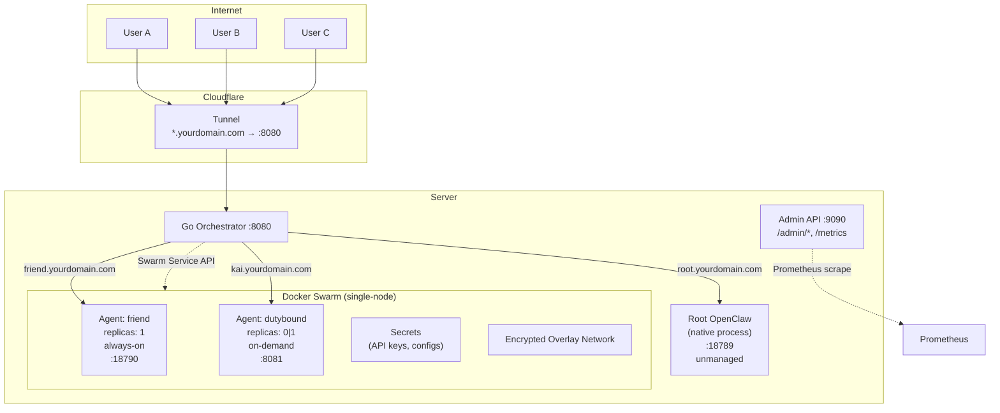

## Responsibility Split

The orchestrator and Swarm have a clean division of labour. The orchestrator never reimplements what Swarm provides natively.

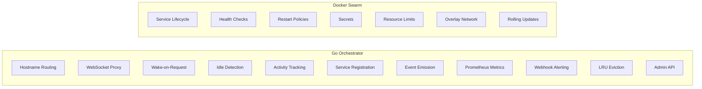

| Concern | Owner | How |
|---|---|---|
| Hostname → backend routing | Orchestrator | Host header map lookup |
| WebSocket proxying | Orchestrator | HTTP Upgrade + bidirectional pipe with frame-level activity |
| Wake-on-request | Orchestrator | Scale service 0→1 on first request |
| Idle timeout / sleep | Orchestrator | Track activity, scale 1→0 after timeout |
| Agent-created service routing | Orchestrator | Dynamic route registration API |
| Event emission | Orchestrator | Structured events for all state transitions |
| Prometheus metrics | Orchestrator | `/metrics` on admin port |
| Webhook alerting | Orchestrator | Slack-compatible POST on events |
| LRU eviction | Orchestrator | Sleep least-recently-used when over capacity |
| Admin API | Orchestrator | Separate port, agent listing, wake/sleep controls |
| Config hot-reload | Orchestrator | SIGHUP reloads YAML, applies runtime-safe changes |
| Health checks + auto-restart | Swarm | Service `healthcheck` + restart policy |
| Secrets | Swarm | `docker secret` → `/run/secrets/` |
| Resource limits | Swarm | Service `resources.limits` |
| Networking | Swarm | Encrypted overlay network |
| Declarative deployment | Swarm | `docker stack deploy` |

## Event System Architecture

The event system is the backbone of Warren's observability. All state transitions emit structured events that flow through a central `Emitter`.

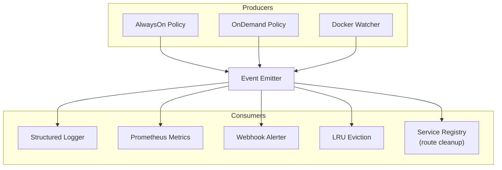

**Event types:**

| Event | Emitted by | Consumed by |
|---|---|---|
| `agent.ready` | OnDemand, AlwaysOn | Metrics, Webhooks, LRU |
| `agent.starting` | OnDemand | Metrics, Webhooks |
| `agent.sleep` | OnDemand | Metrics, Webhooks, Service Registry (purge routes) |
| `agent.wake` | OnDemand | Metrics, Webhooks |
| `agent.degraded` | AlwaysOn, OnDemand | Metrics, Webhooks |
| `agent.health_failed` | AlwaysOn, OnDemand | Metrics |
| `restart.exhausted` | OnDemand | Metrics, Webhooks |
| `docker.*` | Docker Watcher | Metrics |

The `Emitter` is synchronous — handlers run in the emit goroutine. Handlers should be fast and non-blocking. The webhook alerter sends HTTP requests asynchronously.

## Service Registry and Dynamic Routing

Agents can register dynamic hostnames at runtime via the service registration API. This enables agents to expose sub-services (preview servers, dev tools) without pre-configuration.

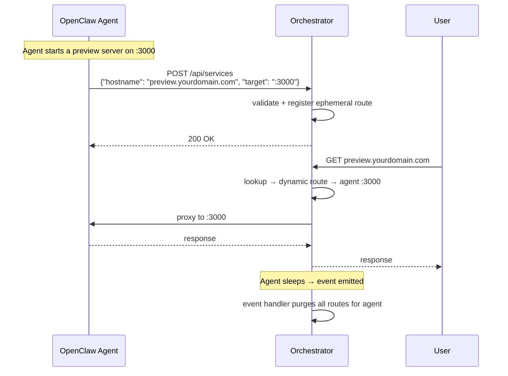

**Key properties:**
- Dynamic routes are ephemeral — they live only as long as the parent agent is awake
- On `agent.sleep` events, the service registry purges all routes for that agent
- Routes resolve to the parent agent's backend with the registered port
- `GET /api/services` lists all registered services; `DELETE /api/services/:hostname` removes one

## Admin API

The admin API runs on a separate port (`admin_listen`) to keep management traffic isolated from proxy traffic.

**Endpoints:**

| Method | Path | Description |
|---|---|---|
| `GET` | `/admin/agents` | List all agents with current state |
| `GET` | `/admin/agents/:name` | Get single agent details |
| `POST` | `/admin/agents/:name/wake` | Manually wake an on-demand agent |
| `POST` | `/admin/agents/:name/sleep` | Manually sleep an on-demand agent |
| `GET` | `/admin/services` | List dynamically registered services |
| `GET` | `/admin/health` | Orchestrator health (uptime, agent count, WS connections) |
| `GET` | `/metrics` | Prometheus metrics endpoint |

## Metrics and Alerting Pipeline

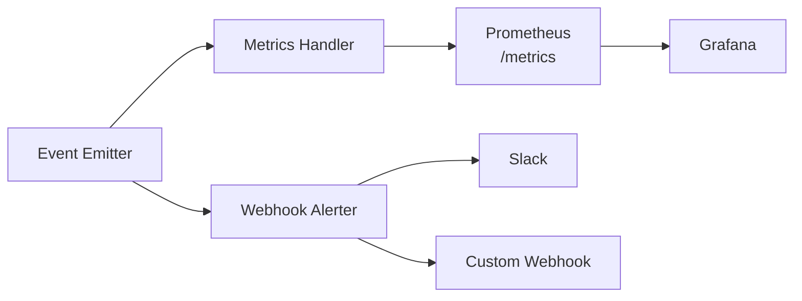

**Prometheus metrics** are registered as an event handler on the emitter. Every event increments counters and updates gauges. Metrics are exposed at `/metrics` on the admin port.

**Webhook alerting** sends Slack-compatible JSON payloads to configured URLs. Each webhook can filter by event type:

```yaml
webhooks:
  - url: "https://your-slack-webhook-url"
    events: ["agent.degraded", "restart.exhausted"]
  - url: "https://my-pagerduty-endpoint.com/webhook"
    headers:
      Authorization: "Bearer xxx"
    events: ["restart.exhausted"]
```

## LRU Eviction Strategy

When `max_ready_agents` is configured, Warren tracks the last activity time of each on-demand agent. When a new agent wakes and the count exceeds the limit, the least-recently-used awake agent is put to sleep.

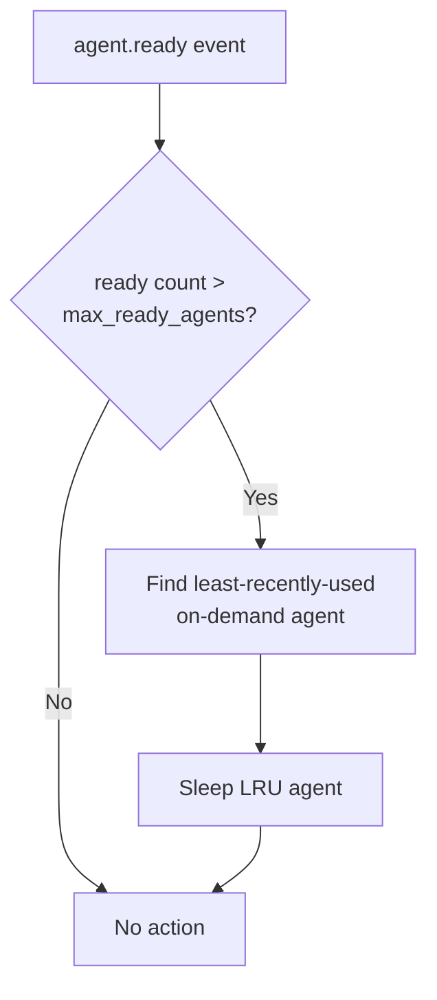

The LRU manager only evicts on-demand agents — always-on agents are never touched. Activity is tracked at the proxy level (HTTP requests and WebSocket frames), so agents with active connections are never evicted.

## Config Hot-Reload

Sending `SIGHUP` to the orchestrator triggers a config reload:

1. Re-read and validate the YAML file
2. Apply runtime-safe changes to existing policies:
   - Idle timeouts
   - Health check intervals
   - Failure thresholds
   - Restart attempt limits
3. Log warnings for structural changes that require a full restart:
   - New or removed agents
   - Hostname changes
   - Backend URL changes

The reload is atomic — if the new config fails validation, the old config stays in effect.

## Graceful Shutdown Flow

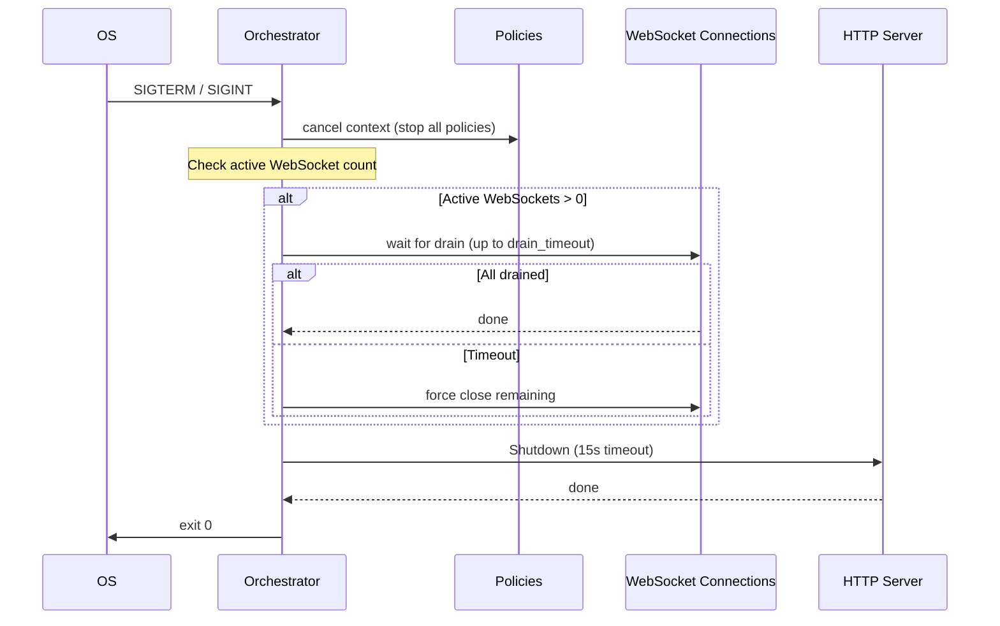

The drain timeout is the maximum `idle.drain_timeout` across all configured agents. During drain, new HTTP requests are rejected but existing WebSocket connections are allowed to close naturally.

## Request Flow

### Always-On Agent

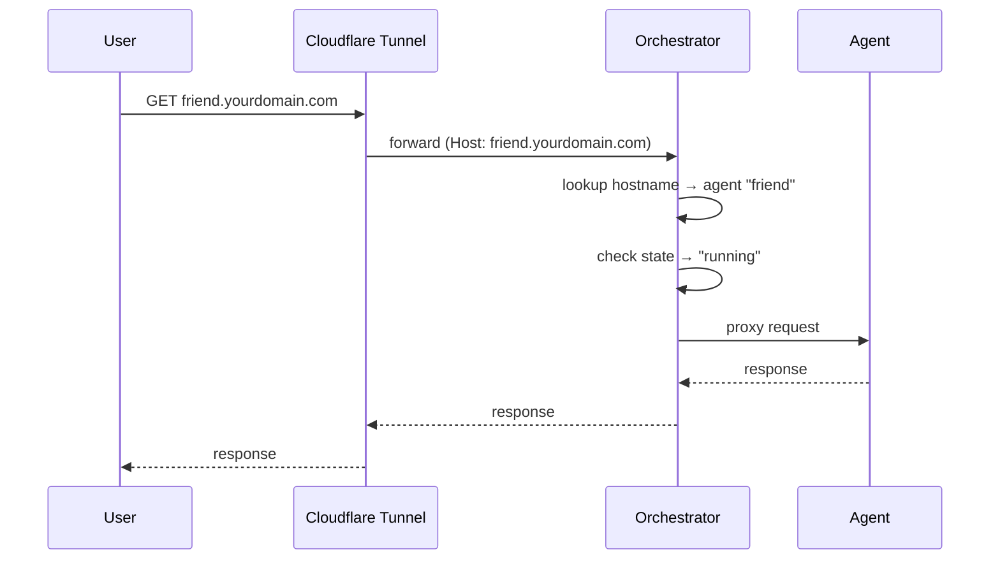

### On-Demand Agent (Cold Start)

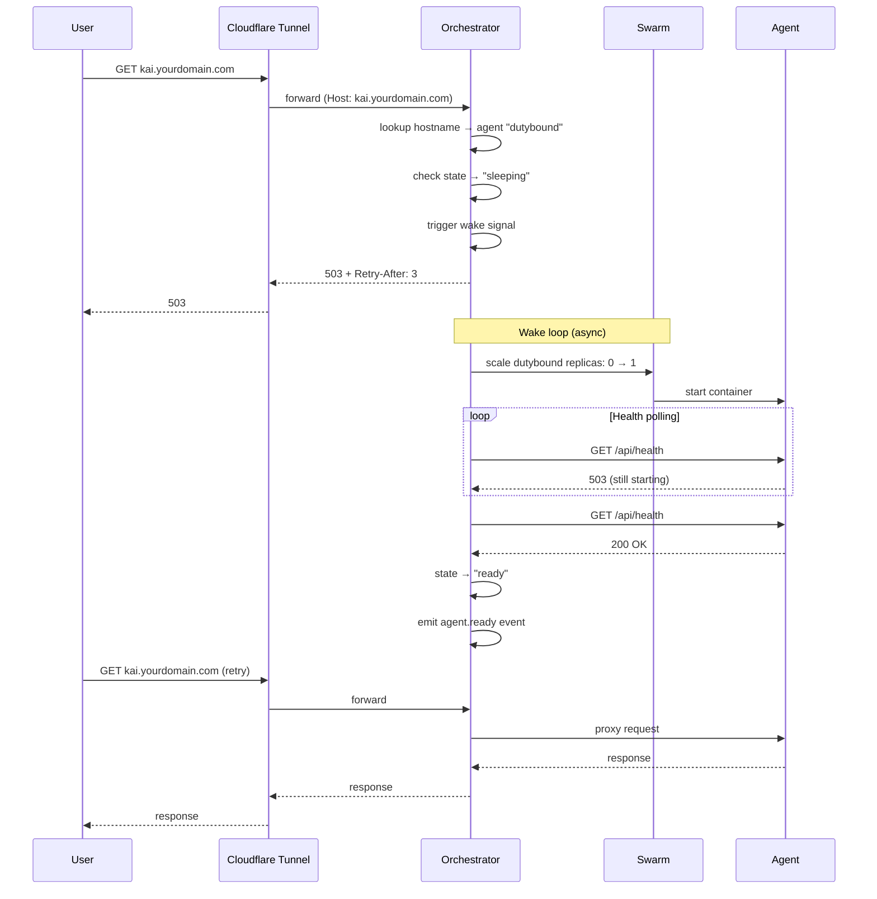

### On-Demand Agent (Idle → Sleep)

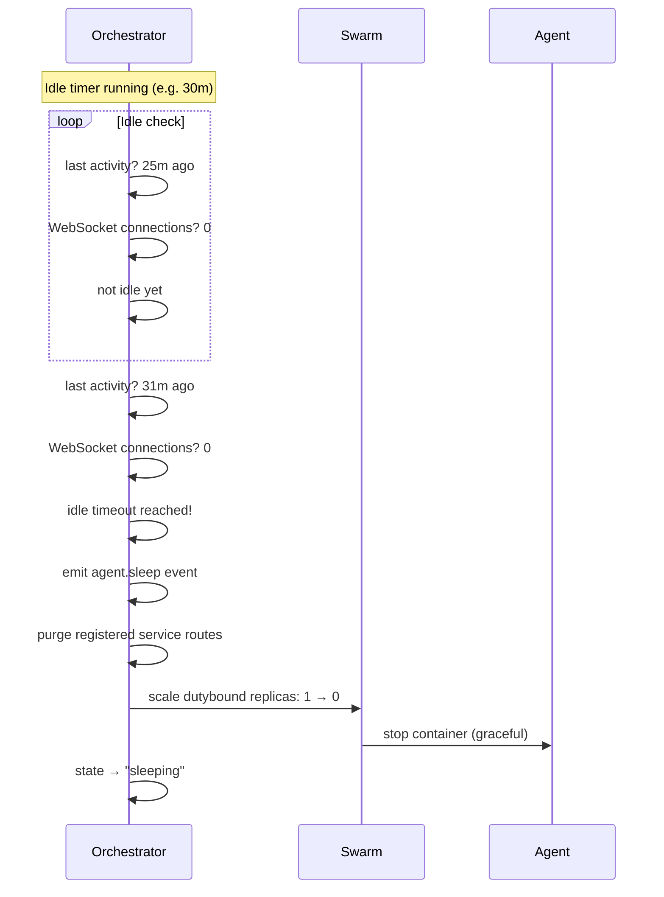

## Policy State Machines

### Always-On

Swarm owns the lifecycle (restarts, health recovery). The orchestrator only monitors health for routing decisions and event emission.

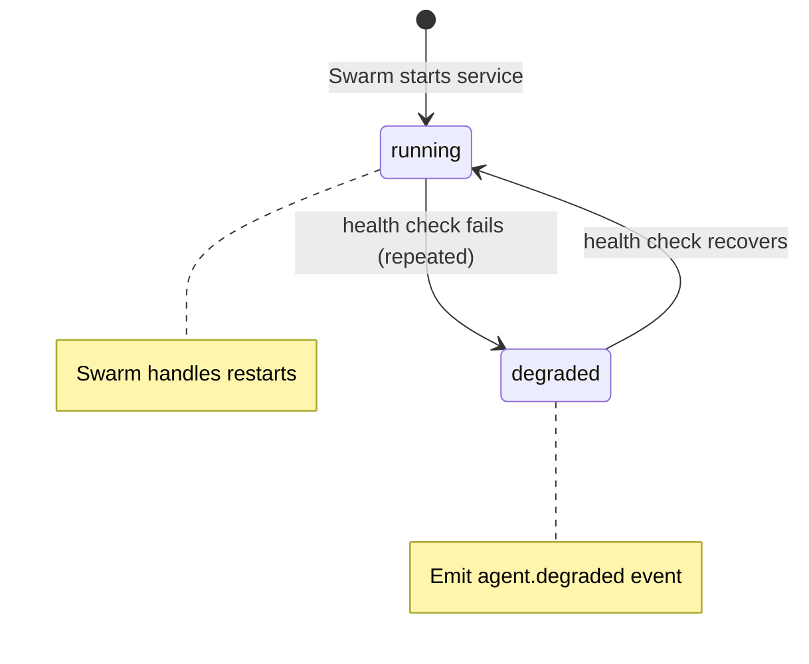

### On-Demand


### Unmanaged

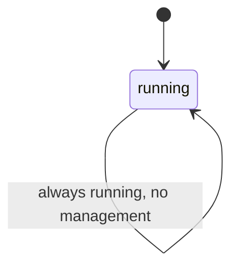

## CLI Architecture

Warren produces two binaries:

- **`warren-server`** — the orchestrator (reverse proxy, lifecycle management, event system, metrics)
- **`warren`** — the CLI client for managing the orchestrator

### How the CLI Works

The CLI is a thin HTTP client that talks to the admin API. It has no direct access to Docker, Swarm, or the config file (except for `reload`, `deploy`, `agent logs`, and `secrets set` which shell out to local commands).

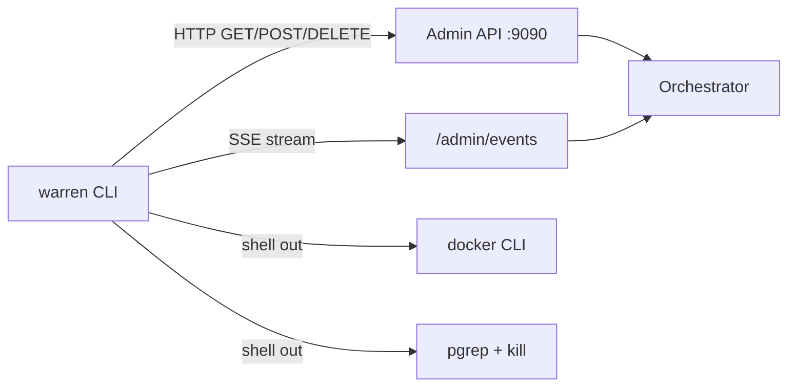

**API-backed commands** (agent list/add/remove/inspect/wake/sleep, service list/add/remove, status, events):
- Pure HTTP calls to the admin API
- No local Docker access required
- Can manage remote orchestrators via `--admin`

**Local commands** (reload, deploy, agent logs, secrets set):
- Shell out to `docker`, `pgrep`, or `kill`
- Must run on the same host as the orchestrator or Docker daemon

**Offline commands** (init, scaffold, config validate):
- No API or Docker access needed
- Generate files or validate config locally

### Event Streaming

`warren events` uses Server-Sent Events (SSE) via `GET /admin/events`. The CLI opens a long-lived HTTP connection and prints each `data:` line as it arrives. This provides real-time visibility into agent state transitions without polling.

### Config Resolution Order

The CLI resolves the admin API URL through a fallback chain:

1. `--admin` flag (highest priority)
2. `WARREN_ADMIN` environment variable
3. `~/.warren/config.yaml` → `admin` field
4. Default: `http://localhost:9090`

This allows flexible usage — local development uses the default, CI/CD uses env vars, and remote management uses the flag or config file.

## Design Decisions

### Why Swarm and Not Kubernetes?

Single server. Swarm is built into Docker, requires zero additional infrastructure, and provides everything needed: service lifecycle, secrets, resource limits, overlay networking, rolling updates. Kubernetes is massive overkill for a single-node deployment managing 5-50 services.

### Why a Custom Proxy and Not Traefik/Caddy?

Traefik and Caddy are excellent reverse proxies but they don't do wake-on-demand. They can route by hostname and terminate TLS, but they can't scale a Swarm service from 0→1 on the first request, track WebSocket activity for idle detection, or manage agent-created dynamic service routes. The orchestrator fills the gap between "reverse proxy" and "service mesh."

### Why Swarm Manages Always-On, Not the Orchestrator?

Swarm's restart policy (`condition: any`, `max_attempts`, `delay`, `window`) handles always-on agent recovery natively. The orchestrator monitors health for routing decisions and emits events when agents degrade, but never calls start/restart/stop on always-on services. One restart loop, not two.

### Why 503 + Poll Instead of Connection Holding?

When an on-demand agent is sleeping, the orchestrator returns 503 with the agent's state in the body and a `Retry-After` header. The frontend polls `/api/health` until the agent is ready, then retries. This is simpler than holding the connection open, avoids request buffering complexity, and gives the frontend full control over the loading UX.

### Why Overlay Network?

Services communicate over Swarm's encrypted overlay network and are addressed by DNS name (`tasks.<service>:<port>`). No host port mapping, no port conflicts, no allocation needed. The orchestrator is the only process that publishes a host port (`:8080` for the tunnel).

### Why a Separate Admin Port?

The admin API exposes operational controls (wake, sleep, metrics) that should not be accessible through the public tunnel. Running on a separate port allows firewall rules to restrict access to localhost or a management network.

### Why LRU and Not Random Eviction?

LRU eviction respects usage patterns. An agent that was used 5 minutes ago is more likely to be needed again than one idle for 2 hours. The activity tracker already exists for idle detection, so LRU adds negligible overhead.

### Why Supervisord Inside Containers?

An OpenClaw agent often needs multiple processes: the OpenClaw gateway and one or more companion services (like MissionControl). These are tightly coupled — they scale together, share a filesystem, and communicate over localhost. Supervisord is the simplest way to manage multiple processes in a single container.

### Why Not Docker Compose?

Docker Compose doesn't provide: secrets management, service scaling (replicas 0↔1), health-check-driven restarts, resource limits, overlay networking, or declarative stack deployment. Swarm mode provides all of these with the same Docker CLI.
