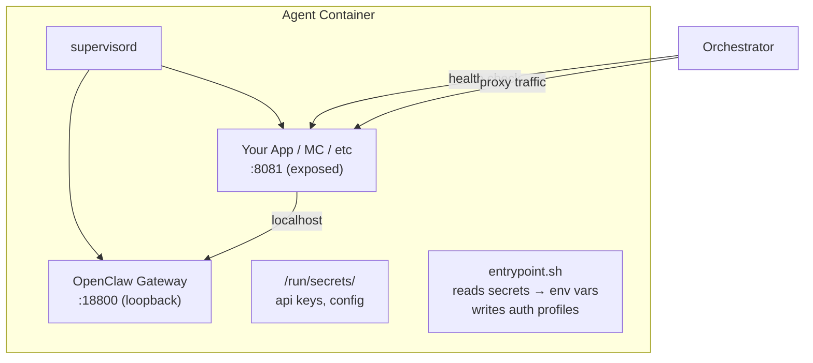
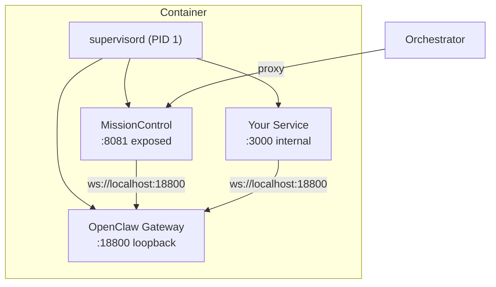
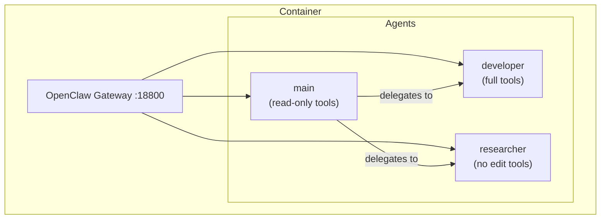

# Containerising OpenClaw Agents

How to package an OpenClaw agent as a Docker image that works with the orchestrator.

## Overview

An OpenClaw agent container needs three things:

1. **The OpenClaw gateway** — the Node.js process that handles WebSocket communication
2. **A health endpoint** — an HTTP URL the orchestrator can poll
3. **Secret injection** — reading API keys from Swarm secrets at runtime, not baked into the image



## Minimal Single-Agent Image

The simplest case: one OpenClaw agent, no companion services.

### Dockerfile

```dockerfile
FROM node:22-bookworm

RUN apt-get update && apt-get install -y --no-install-recommends \
    ca-certificates git curl \
    && rm -rf /var/lib/apt/lists/*

# Create non-root user
RUN useradd -m -s /bin/bash agent

# Copy OpenClaw (pre-built)
WORKDIR /openclaw
COPY openclaw/ ./
RUN chown -R agent:agent /openclaw

# Set up agent config
USER agent
RUN mkdir -p /home/agent/.openclaw/agents/main/agent \
             /home/agent/.openclaw/agents/main/sessions \
             /home/agent/.openclaw/workspace

COPY --chown=agent:agent openclaw.json /home/agent/.openclaw/openclaw.json
COPY --chown=agent:agent entrypoint.sh /entrypoint.sh

USER root

EXPOSE 18800

HEALTHCHECK --interval=10s --timeout=5s --retries=3 \
    CMD curl -f http://localhost:18800/health || exit 1

ENTRYPOINT ["/entrypoint.sh"]
CMD ["node", "/openclaw/openclaw.mjs", "gateway", "--port", "18800"]
```

### entrypoint.sh

```bash
#!/bin/bash
set -e

# Read Swarm secrets into env vars
if [ -f /run/secrets/anthropic_api_key ]; then
    export ANTHROPIC_API_KEY=$(cat /run/secrets/anthropic_api_key)
fi

# Write auth profile for the OpenClaw agent
if [ -n "$ANTHROPIC_API_KEY" ]; then
    cat > /home/agent/.openclaw/agents/main/agent/auth-profiles.json <<EOF
{
  "version": 1,
  "profiles": {
    "anthropic:default": {
      "type": "token",
      "provider": "anthropic",
      "token": "$ANTHROPIC_API_KEY"
    }
  },
  "lastGood": {
    "anthropic": "anthropic:default"
  }
}
EOF
fi

exec "$@"
```

### openclaw.json

```json
{
  "auth": {
    "profiles": {
      "anthropic:default": {
        "provider": "anthropic",
        "mode": "token"
      }
    }
  },
  "agents": {
    "defaults": {
      "workspace": "/home/agent/.openclaw/workspace"
    },
    "list": [
      {
        "id": "main",
        "default": true,
        "workspace": "/home/agent/.openclaw/workspace"
      }
    ]
  },
  "gateway": {
    "port": 18800,
    "mode": "local",
    "bind": "loopback",
    "auth": {
      "mode": "token"
    }
  }
}
```

## Multi-Process Image (with Supervisord)

When your agent needs a companion service — like MissionControl, a web server, or a custom backend — use supervisord to manage multiple processes in one container.



### Dockerfile (multi-process)

```dockerfile
FROM node:22-bookworm

RUN apt-get update && apt-get install -y --no-install-recommends \
    supervisor ca-certificates git curl \
    && rm -rf /var/lib/apt/lists/*

RUN useradd -m -s /bin/bash agent

# Copy OpenClaw gateway
WORKDIR /openclaw
COPY openclaw/ ./
RUN chown -R agent:agent /openclaw

# Copy your companion binary/app
COPY --from=builder /app /usr/local/bin/myapp

# Agent config
USER agent
RUN mkdir -p /home/agent/.openclaw/agents/main/agent \
             /home/agent/.openclaw/agents/main/sessions \
             /home/agent/.openclaw/workspace

COPY --chown=agent:agent openclaw.json /home/agent/.openclaw/openclaw.json
USER root

COPY supervisord.conf /etc/supervisor/conf.d/supervisord.conf
COPY entrypoint.sh /entrypoint.sh

EXPOSE 8081

HEALTHCHECK --interval=10s --timeout=5s --retries=3 \
    CMD curl -f http://localhost:8081/api/health || exit 1

ENTRYPOINT ["/entrypoint.sh"]
```

### supervisord.conf

```ini
[supervisord]
nodaemon=true
logfile=/dev/stdout
logfile_maxbytes=0

[program:openclaw-gateway]
command=node /openclaw/openclaw.mjs gateway --port 18800 --bind loopback
autorestart=true
user=agent
environment=HOME="/home/agent",OPENCLAW_GATEWAY_TOKEN="%(ENV_OPENCLAW_GATEWAY_TOKEN)s"
stdout_logfile=/dev/fd/1
stdout_logfile_maxbytes=0
stderr_logfile=/dev/fd/2
stderr_logfile_maxbytes=0

[program:myapp]
command=/usr/local/bin/myapp serve --port 8081
autorestart=true
user=agent
environment=HOME="/home/agent",OPENCLAW_GATEWAY="ws://localhost:18800",OPENCLAW_TOKEN="%(ENV_OPENCLAW_GATEWAY_TOKEN)s"
stdout_logfile=/dev/fd/1
stdout_logfile_maxbytes=0
stderr_logfile=/dev/fd/2
stderr_logfile_maxbytes=0
```

The entrypoint reads secrets and exec's supervisord:

```bash
#!/bin/bash
set -e

if [ -f /run/secrets/anthropic_api_key ]; then
    export ANTHROPIC_API_KEY=$(cat /run/secrets/anthropic_api_key)
fi
if [ -f /run/secrets/gateway_token ]; then
    export OPENCLAW_GATEWAY_TOKEN=$(cat /run/secrets/gateway_token)
fi

# Write auth profiles...
# (same as single-agent example)

exec supervisord -c /etc/supervisor/conf.d/supervisord.conf
```

## Multi-Agent Image

An OpenClaw container can host multiple agents (main, developer, researcher, etc.) that share a gateway. This is useful when you want specialised sub-agents with different tool permissions.



Configure in `openclaw.json`:

```json
{
  "agents": {
    "defaults": {
      "workspace": "/home/agent/.openclaw/workspace",
      "maxConcurrent": 4,
      "subagents": { "maxConcurrent": 8 }
    },
    "list": [
      {
        "id": "main",
        "default": true,
        "subagents": {
          "allowAgents": ["developer", "researcher"]
        },
        "tools": {
          "deny": ["write", "edit", "apply_patch"]
        }
      },
      {
        "id": "developer",
        "tools": {}
      },
      {
        "id": "researcher",
        "tools": {
          "deny": ["edit", "apply_patch"]
        }
      }
    ]
  }
}
```

Each agent needs its own directory structure:

```bash
mkdir -p /home/agent/.openclaw/agents/{main,developer,researcher}/{agent,sessions}
```

The entrypoint writes `auth-profiles.json` into every agent directory.

## Health Endpoints

The orchestrator needs an HTTP endpoint to check if your agent is healthy. What you expose depends on your setup:

| Setup | Health endpoint | What responds |
|---|---|---|
| Gateway only | `http://localhost:18800/health` | OpenClaw gateway |
| Gateway + app | `http://localhost:8081/api/health` | Your app (which depends on the gateway) |
| Custom | Any HTTP URL returning 2xx | You decide |

Configure in `orchestrator.yaml`:

```yaml
health:
  url: "http://localhost:8081/api/health"
  check_interval: 30s
  startup_timeout: 60s
  max_failures: 3
```

The orchestrator considers any HTTP 2xx response as healthy. Anything else (including connection refused, timeout, 4xx, 5xx) counts as a failure.

## Swarm Deployment

### Creating Secrets

```bash
# API key
echo "sk-ant-your-key" | docker secret create my-agent-api-key -

# Gateway token (for internal auth between processes)
openssl rand -hex 32 | docker secret create my-agent-gateway-token -

# Config files
cat openclaw.json | docker secret create my-agent-config -
```

### Stack File

```yaml
version: "3.8"

services:
  my-agent:
    image: my-agent:latest
    deploy:
      replicas: 1  # or 0 for on-demand
      restart_policy:
        condition: any
        delay: 5s
        max_attempts: 10
        window: 120s
      resources:
        limits:
          cpus: "2.0"
          memory: 4G
        reservations:
          cpus: "0.5"
          memory: 1G
    ports:
      - "8081:8081"
    secrets:
      - my-agent-api-key
      - my-agent-gateway-token
    networks:
      - agent-net
    healthcheck:
      test: ["CMD", "curl", "-f", "http://localhost:8081/api/health"]
      interval: 10s
      timeout: 5s
      retries: 3
      start_period: 30s

secrets:
  my-agent-api-key:
    external: true
  my-agent-gateway-token:
    external: true

networks:
  agent-net:
    driver: overlay
    encrypted: true
```

### Deploy

```bash
docker stack deploy -c stack.yaml openclaw
docker service ls
docker service ps openclaw_my-agent
```

## Checklist

Before deploying an agent container:

- [ ] Entrypoint reads secrets from `/run/secrets/` — never bake keys into the image
- [ ] Auth profiles written at runtime from secrets
- [ ] Health endpoint accessible and returns 2xx when ready
- [ ] Non-root user for all application processes
- [ ] Logs go to stdout/stderr (not files) so Docker captures them
- [ ] `HEALTHCHECK` in Dockerfile for Swarm's built-in monitoring
- [ ] Resource limits set in stack file
- [ ] Secrets created in Swarm before deploying